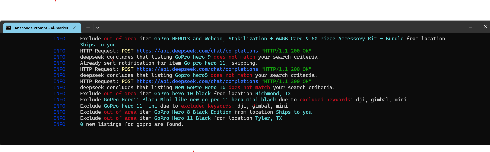

<div align="center">

[](https://pypi.python.org/pypi/ai-marketplace-monitor)
[](https://pypi.python.org/pypi/ai-marketplace-monitor)
[](https://github.com/BoPeng/ai-marketplace-monitor/actions?workflow=tests)
[](https://codecov.io/gh/BoPeng/ai-marketplace-monitor)
[](https://ai-marketplace-monitor.readthedocs.io/)
[](https://pypi.python.org/pypi/ai-marketplace-monitor)

[](https://github.com/psf/black)
[](https://github.com/pre-commit/pre-commit)
[](https://www.contributor-covenant.org/version/2/1/code_of_conduct/)

</div>

An intelligent tool that monitors Facebook Marketplace listings using AI to help you find the best deals. Get instant notifications when items matching your criteria are posted, with AI-powered analysis of each listing.

**📚 [Read the Full Documentation](https://ai-marketplace-monitor.readthedocs.io/)**



Example notification from PushBullet:

```
Found 1 new gopro from facebook
[Great deal (5)] Go Pro hero 12
$180, Houston, TX
https://facebook.com/marketplace/item/1234567890
AI: Great deal; A well-priced, well-maintained camera meets all search criteria, with extra battery and charger.
```

## What's New

- **Guided Facebook login**: aimm types your Facebook username and password, then waits for you to complete any CAPTCHA or security code before it searches. In Docker, the web UI shows a banner with an **Open browser** button. See [Run the Monitor](#run-the-monitor).
- **AI-assisted configuration**: `aimm configure` guides users through AI services, marketplace searches, items, notifications, regions, translations, and monitor settings without hand-writing TOML.
- **UnitySVC for AI and notifications**: Use one [UnitySVC](https://unitysvc.com/) key for almost arbitrary AI models and 100+ notification channels. See [AI Services](docs/README.md#ai-services) and [UnitySVC notification](docs/README.md#unitysvc-notification).
- **Built-in Web UI**: Edit config, add AI backends, and monitor live logs from your browser — starts automatically with the monitor. See [Web UI documentation](docs/webui.md).
- **Anthropic/Claude AI Backend**: Use Claude models (e.g. `claude-sonnet-5-5`) to evaluate listings alongside OpenAI, DeepSeek, Gemini, and Ollama. See [AI Services](docs/README.md#ai-services) for configuration.
- **Configurable Rate Limiting**: Rate limiting framework for all notification types with per-instance and global limits. Telegram notifications use optimized defaults automatically.

**Table of Contents:**

- [What's New](#whats-new)
- [✨ Key Features](#-key-features)
- [🚀 Quick Start](#-quick-start)
- [💡 Example Usage](#-example-usage)
- [📚 Documentation](#-documentation)
- [🤝 Contributing](#-contributing)
- [📜 License](#-license)
- [💬 Support](#-support)
- [🙏 Credits](#-credits)

## ✨ Key Features

🔍 **Smart Search**

- Search multiple products using keywords
- Filter by price and location
- Exclude irrelevant results and spammers
- Support for different Facebook Marketplace layouts

🤖 **AI-Powered**

- Intelligent listing evaluation
- Smart recommendations
- AI-assisted configuration editing with `aimm configure` and the Web UI Configure chat
- Almost arbitrary AI models through [UnitySVC](https://unitysvc.com/), plus OpenAI, Anthropic, DeepSeek, Gemini, and Ollama
- Self-hosted model option through Ollama

📱 **Notifications**

- 100+ notification channels through [UnitySVC](https://unitysvc.com/)
- PushBullet, PushOver, Telegram, and Ntfy notifications
- HTML email notifications with images
- Customizable notification levels
- Repeated notification options
- Optional daily digest (`digest_at`) of searches, matches and rejected listings: the full digest by email, a short summary on push channels

🖥️ **Web UI**

- Built-in config editor with TOML syntax highlighting
- Live log streaming and filtering
- A **Listings** table of every listing aimm evaluated, with its AI rating and why it was notified, rejected, or excluded
- Add, edit, and delete config sections from your browser
- No password required on localhost


🌎 **Location Support**

- Multi-city search
- Pre-defined regions (USA, Canada, etc.)
- Customizable search radius
- Flexible seller location filtering

## 🚀 Quick Start

> **⚠️ Legal Notice**: Facebook's EULA prohibits automated data collection without authorization. This tool was developed for personal, hobbyist use only. You are solely responsible for ensuring compliance with platform terms and applicable laws.

### Installation

> **Requires Python 3.10 or higher.** Check your version with `python --version`. If your system default is older, use `pip3.10` (or `pip3.11`, `pip3.12`, etc.) instead of `pip`, or create a virtual environment with the correct version.

```bash
pip install ai-marketplace-monitor
playwright install
```

### Configure with AI

Most users do not need to write a configuration file by hand. Set one AI provider
key, then let `aimm configure` create or update `~/.ai-marketplace-monitor/config.toml`
through a guided conversation:

```bash
export OPENAI_API_KEY='your_openai_key'
# or: export ANTHROPIC_API_KEY='your_anthropic_key'
# or: export UNITYSVC_API_KEY='your_unitysvc_key'

# aimm searches only while logged in to Facebook
export FACEBOOK_USERNAME='you@example.com'
export FACEBOOK_PASSWORD='your_facebook_password'

aimm configure
```

aimm reads your Facebook username and password from `FACEBOOK_USERNAME` and
`FACEBOOK_PASSWORD` (or from `username` and `password` in
`[marketplace.facebook]`). They are required: aimm does not search without
logging in.

`aimm configure` checks or creates the AI setup first, then asks what you want to
configure: marketplace searches, items to watch, notifications, regions,
translations, or monitor settings. It explains proposed changes and asks before
writing them.

You can also jump directly to one section:

```bash
aimm configure ai
aimm configure marketplace
aimm configure item.gopro
```

Here is a real session that adds an item. `aimm configure` starts with a summary of what is
already configured and what is still missing, drafts the item from one plain-language request,
and shows the change before writing it:

```text
$ aimm configure
Using [ai.anthropic].
Thinking...
AIMM: Hi! You have two AI services (Anthropic, and UnitySVC with qwen3.7-flash), a Facebook
Marketplace search around Houston, and notifications to you (user "me") via UnitySVC. The one thing
still missing is an item to search for, so aimm can't monitor anything yet. Want to start by adding
one?

You can say things like "I want to add an item" (e.g. "watch for a GoPro under $200"), "update my
marketplace settings", or "what can I configure?".
You: I want to watch for an action camera: a GoPro Hero 9 or newer, a DJI Osmo Action 3 or newer,
or an Insta360 X3, X4 or Ace Pro. Used is fine if it works, with no water damage and no scratched
lens. Preferably under $250. Same Houston area, check every 30 minutes.
Thinking...
Thinking...
Thinking...
Thinking...
New item "action_camera": GoPro Hero 9+, DJI Osmo Action 3+, Insta360 X3/X4/Ace Pro; used OK if
working, no water damage or scratched lens; max $250; checked every 30 minutes; Houston area (20
miles) from your existing marketplace.

 [item.action_camera]
 request = "Watch for an action camera (GoPro Hero 9+, DJI Osmo Action 3+, Insta360 X3/X4/Ace Pro),
 used OK if working, no water damage or scratched lens, preferably under $250, in the Houston area,
 checked every 30 minutes."
 search_phrases = ["gopro hero", "dji osmo action", "insta360 x3", "insta360 x4", "insta360 ace pro",
 "action camera"]
 description = "Action camera: GoPro Hero 9 or newer, DJI Osmo Action 3 or newer, or Insta360 X3,
 X4 or Ace Pro. Used is fine if it works. No water damage and no scratched lens."
 keywords = ["gopro", "go pro", "dji", "osmo", "insta360"]
 max_price = "250"
 search_interval = "30m"

 (a diff of ~/.ai-marketplace-monitor/config.toml follows)

Write these changes? [Y/n] y
Saved ~/.ai-marketplace-monitor/config.toml.
Thinking...
AIMM: I've saved the action camera item. It covers GoPro Hero 9+, DJI Osmo Action 3+ and Insta360
X3/X4/Ace Pro. It accepts used cameras that work, with no water damage or scratched lens. The price
limit is $250, and it's checked every 30 minutes in your Houston area (20 miles). I set the price as
a hard limit. I can't make it a soft preference.

Is there anything else you'd like to change?
You: No, that's all. Thanks.
Thinking...
AIMM: All done. Enjoy the hunt!
Your configuration is saved, but nothing is searching yet: run `aimm run` to start monitoring (a
monitor that is already running picks up the change on its own).
```

### Run the Monitor

```bash
aimm
```

What happens next:

1. aimm opens a browser window, goes to Facebook, and types your username and
   password.
2. If Facebook asks for a CAPTCHA or a security code, complete it in that
   window. aimm waits as long as it takes (the web UI shows a "waiting for
   Facebook login" banner) and reminds you in the log every few minutes.
3. Once you are logged in, aimm searches Facebook Marketplace and notifies you
   of matching items. If Facebook logs it out later, it waits for you the same
   way.

A web UI also starts automatically at [http://127.0.0.1:8467](http://127.0.0.1:8467) for editing config and monitoring logs — see [Web UI Guide](docs/webui.md). `aimm` is the same as `aimm run`; `ai-marketplace-monitor` provides the same interface.

**You never need to restart aimm to change your configuration.** Save the config file, in the web UI, with `aimm configure` or in any editor, and the running monitor picks up the change on its own: after the current search it reloads the configuration and searches all items with it. The **⏸** button in the web UI stops the monitor only when you need its browser to yourself, and **▶** starts it again.

aimm always shows its browser, because Facebook may ask you to complete a CAPTCHA or a security code. To run aimm on a server, a NAS or another machine without a screen, use the [Docker image](#run-with-docker): it has a virtual display, and the web UI shows you its browser when you need it.

### Run with Docker

A prebuilt image on GitHub Container Registry runs aimm on a server, a NAS or macOS. It has a virtual display, and the web UI shows you its browser when Facebook asks for a CAPTCHA or a security code.

```bash
docker run -d --name aimm \
  -p 8467:8467 \
  -v "$HOME/.ai-marketplace-monitor:/data" \
  -e FACEBOOK_USERNAME -e FACEBOOK_PASSWORD \
  -e UNITYSVC_API_KEY \
  --restart unless-stopped \
  ghcr.io/bopeng/ai-marketplace-monitor:latest
```

`UNITYSVC_API_KEY` needs a [UnitySVC](https://unitysvc.com/) account and an API key you create there. In the default configuration, that one key covers any AI engine (OpenAI, Anthropic and more, as UnitySVC platform services or with your own provider keys saved in UnitySVC) and email and phone notifications; see [AI Services](docs/README.md#ai-services) and [UnitySVC notification](docs/README.md#unitysvc-notification).

Then open [http://localhost:8467](http://localhost:8467) and sign in with your Facebook username and password, the values of `FACEBOOK_USERNAME` and `FACEBOOK_PASSWORD`. If Facebook asks for a check, click **Open browser** in the banner of the web UI and complete it there; searches start once you are logged in.

See the [Docker installation guide](https://ai-marketplace-monitor.readthedocs.io/en/latest/installation.html#docker) ([source](docs/docker-installation.md)) for Docker Compose with a `.env` file (the files are in [`docker-compose/`](docker-compose/)), running behind a reverse proxy, updates, and running aimm commands in the container.

## 💡 Example Usage

These are examples of configuration sections that `aimm configure` can create or
update for you. Advanced users can still edit the TOML file directly.

**Find GoPro cameras under $300:**

```toml
[item.gopro]
search_phrases = 'Go Pro Hero'
keywords = "('Go Pro' OR gopro) AND (11 OR 12 OR 13)"
min_price = 100
max_price = 300
```

**Search nationwide with shipping:**

```toml
[item.rare_item]
search_phrases = 'vintage collectible'
search_region = 'usa'
delivery_method = 'shipping'
seller_locations = []
```

**AI-powered filtering:**

```toml
[ai.openai]
api_key = 'your_openai_key'

[item.camera]
description = '''High-quality DSLR camera in good condition.
Exclude listings with water damage or missing parts.'''
rating = 5  # Only notify for great deals (default: 4+)
```

**Alerts on your phone and by email, plus a daily digest:**

```toml
[user.me]
email = 'me@gmail.com'
notify_with = ['unitysvc', 'gmail']
# every morning at 8: a summary of everything aimm did in the last 24 hours,
# in full by email and as a short message on your phone
digest_at = '08:00'

[notification.unitysvc]
unitysvc_api_key = '${UNITYSVC_API_KEY}'

[notification.gmail]
smtp_password = '${GMAIL_APP_PASSWORD}'
```

## 📚 Documentation

For detailed information on setup and advanced features, see the comprehensive documentation:

- **[📖 Full Documentation](https://ai-marketplace-monitor.readthedocs.io/)** - Complete guide and reference
- **[🚀 Quick Start Guide](https://ai-marketplace-monitor.readthedocs.io/en/latest/quickstart.html)** - Get up and running in 10 minutes
- **[🔍 Features Overview](https://ai-marketplace-monitor.readthedocs.io/en/latest/features.html)** - Complete feature list
- **[📱 Usage Guide](https://ai-marketplace-monitor.readthedocs.io/en/latest/usage.html)** - Command-line options and tips
- **[🔧 Configuration Guide](https://ai-marketplace-monitor.readthedocs.io/en/latest/configuration-guide.html)** - Notifications, AI prompts, multi-location search
- **[⚙️ Configuration Reference](https://ai-marketplace-monitor.readthedocs.io/en/latest/configuration.html)** - Complete configuration reference
- **[🖥️ Web UI Guide](docs/webui.md)** - Built-in web interface for config editing and monitoring

### Key Topics Covered in Documentation

**Notification Setup:**

- UnitySVC notification catalog with 100+ channels, plus Email (SMTP), PushBullet, PushOver, Telegram, and Ntfy
- Multi-user configurations
- HTML email templates

**AI Integration:**

- AI-assisted configuration editing with `aimm configure`
- UnitySVC access to almost arbitrary AI models, plus OpenAI, DeepSeek, Gemini, Anthropic, and Ollama setup
- Custom prompt configuration
- Rating thresholds and filtering

**Advanced Search:**

- Multi-city and region search
- Currency conversion
- Keyword filtering with Boolean logic
- Searching through a proxy

**Configuration:**

- TOML file structure
- Environment variables
- Multiple marketplace support
- Language/translation support

## 🤝 Contributing

Contributions are welcome! Here are some ways you can contribute:

- 🐛 Report bugs and issues
- 💡 Suggest new features
- 🔧 Submit pull requests
- 📚 Improve documentation
- 🏪 Add support for new marketplaces
- 🌍 Add support for new regions and languages
- 🤖 Add support for new AI providers
- 📱 Add new notification methods

Please read our [Contributing Guidelines](https://ai-marketplace-monitor.readthedocs.io/en/latest/contributing.html) before submitting a Pull Request.

## 📜 License

This project is licensed under the **Affero General Public License (AGPL)**. For the full terms and conditions, please refer to the official [GNU AGPL v3](https://www.gnu.org/licenses/agpl-3.0.en.html).

## 💬 Support

We provide multiple ways to access support and contribute to AI Marketplace Monitor:

- 💬 [Discord](https://discord.gg/2GJhstD7av) - Ask questions, share your searches, and hear about new releases (no GitHub account needed)
- 📖 [Documentation](https://ai-marketplace-monitor.readthedocs.io/) - Comprehensive guides and instructions
- 🤝 [Discussions](https://github.com/BoPeng/ai-marketplace-monitor/discussions) - Community support and ideas
- 🐛 [Issues](https://github.com/BoPeng/ai-marketplace-monitor/issues) - Bug reports and feature requests
- 💖 [Become a sponsor](https://github.com/sponsors/BoPeng) - Support development
- 💰 [Donate via PayPal](https://www.paypal.com/donate/?hosted_button_id=3WT5JPQ2793BN) - Alternative donation method

**Important Note:** Due to time constraints, priority support is provided to sponsors and donors. For general questions, please join us on [Discord](https://discord.gg/2GJhstD7av) or use GitHub Discussions; report bugs as GitHub Issues.

## 🙏 Credits

- Some of the code was copied from [facebook-marketplace-scraper](https://github.com/passivebot/facebook-marketplace-scraper).
- Region definitions were copied from [facebook-marketplace-nationwide](https://github.com/gmoz22/facebook-marketplace-nationwide/), which is released under an MIT license as of Jan 2025.
- This package was created with [Cookiecutter](https://github.com/cookiecutter/cookiecutter) and the [cookiecutter-modern-pypackage](https://github.com/fedejaure/cookiecutter-modern-pypackage) project template.
