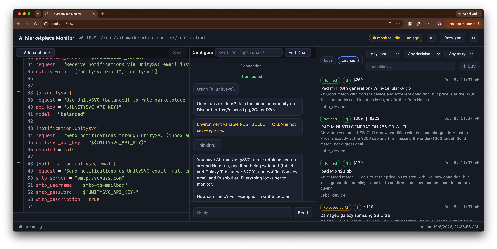

# Web UI

AI Marketplace Monitor includes a built-in web interface for editing your configuration and monitoring activity in real time. The web UI starts automatically when you run the monitor — no extra setup needed.



## Overview

The web UI provides:

- **TOML Config Editor** with syntax highlighting, powered by CodeMirror
- **Configure Chat** that uses the same AI-assisted configuration tools as `aimm configure`
- **Add / Edit / Delete** config sections (items, AI backends, users, marketplaces) through guided forms
- **Live Log Streaming** with filtering by level (all, problems, or errors) and text search; click a line to see its details
- **Listings** view of every listing aimm evaluated, with its AI rating and the decision: notified, rejected by AI, or excluded (see [Listings](#listings))
- **Version** of the running aimm (`vX.Y.Z`) in the header, next to the app name; click it to open Settings, About
- **⏸ / ▶** button in the header: ⏸ pauses searches after the current listing, and ▶ resumes them and searches all items right away
- **Login banner** while aimm waits for you to finish logging in to Facebook (a CAPTCHA or a security code). It says where to complete it; in Docker, its **Open browser** button (like **Browser** in the header) opens aimm's browser in a new tab
- **⚙ Settings** at the right end of the header (see below): the version and updates, test notifications, the cache, Export CSV and Logout
- **⬆ aimm X available** in the header when a newer release is out; it opens Settings, About
- **Auto-validation** of your config as you type

## Getting Started

Simply run the monitor:

```bash
aimm
```

The web UI is available at [http://127.0.0.1:8467](http://127.0.0.1:8467). A startup banner in the terminal shows the URL:

```
╭──────────── Web UI ────────────╮
│ 🌐  http://127.0.0.1:8467      │
│                                │
│ No password required           │
│ (local access only).           │
╰────────────────────────────────╯
```

On localhost, **no password is required**. Open the URL in your browser and start editing.

## Configure Chat

The **Configure** pane lets you edit the config through the same AI-assisted flow as
`aimm configure`. Leave the section field blank to let the assistant route the request,
or enter a section address such as `ai`, `marketplace`, `item.gopro`, or `notification`
before starting. The chat asks for confirmation before tool-driven changes are written,
then the editor reloads the updated config. After a notification is saved, the assistant
offers to send a test message through it, so you can fix a channel that does not work
right away.

## Settings

The **⚙** button at the right end of the header opens Settings:

- **About**: the running version and whether a newer release is out. In Docker, an
  **Update** button installs it in the container and restarts aimm; elsewhere, it shows the
  upgrade command and a link to the changelog.
- **Notifications**: one row per user with a **Send test** button. aimm sends a sample
  listing titled "aimm test notification" through each of the user's channels, once, in
  the channel's real format (HTML email with a photo, text or Markdown for chat and phone),
  and
  shows ✓ or ✗ with the error for each channel. It is a real message (metered channels such
  as UnitySVC SMS may cost a little), but nothing is recorded in the cache. This is the same
  test as `aimm admin --test-notification`.
- **Cache**: the number of entries of each type (listing details, AI ratings, notified
  records, counters, update check), with a **Clear** button for each type and **Clear all**.
  Clearing notified records means listings you were already notified about can be sent
  again; clearing AI ratings means new AI calls. A cache that cannot be read can only be
  cleared as a whole: aimm removes its files, then restarts in Docker (elsewhere, restart
  aimm yourself).
- **Account**: **Export CSV** downloads all found (notified) listings — link, price, rating,
  and details — as a CSV file; **Logout** signs out (only when a password is required).

## Logs and Listings

The **Logs | Listings** switch at the left of the bottom pane's toolbar picks what the pane shows.

### Logs

The live log of the monitor. **All** shows every message, **Problems** shows warnings and
errors, and **Errors** shows errors only; a red badge on **Errors** counts errors you have not
looked at yet. Type in the text filter to show matching messages, and click a message to see its
details, such as the item, listing and AI score.

### Listings

A table of every listing aimm evaluated in the last 30 days, newest first, with:

- the time of the decision, the item, and the listing title (a link to the listing)
- the price and the AI rating (1–5, or – if the AI did not rate it)
- the decision: **Notified**; **Rejected by AI** when the rating is below the item's `rating`;
  or **Excluded** before the AI, for an excluded keyword, missing required keywords, a seller
  outside `seller_locations`, or a seller in `exclude_sellers`. The reason is shown under the
  title and when you hover over the decision.

Filter by item, decision, minimum rating and text, and click **Time** or **Rating** to sort. The
table refreshes every 30 seconds. **⬇ CSV** downloads the listings that match the filters, in
the same order. A listing that aimm evaluates again (for example, after you change the item)
shows its latest decision. To keep the history longer or shorter than 30 days, set
`evaluation_history_days` in the `[monitor]` section (a shorter history also applies to
listings already recorded):

```toml
[monitor]
evaluation_history_days = 60
```

## Disabling the Web UI

If you don't need the web UI, disable it with:

```bash
aimm run --no-webui
```

## Changing the Port

To use a different port:

```bash
aimm run --webui-port 9090
```

## Advanced: Remote Access

By default, the web UI only listens on `127.0.0.1` (localhost) and requires no password. To access it from another machine on your network, you need to:

1. **Configure credentials** so the web UI is protected by a login screen.
2. **Bind to a network interface** so other machines can connect.
3. **Open a firewall port** if your system has a firewall enabled.

### Step 1: Set up username and password

The web UI uses your marketplace credentials for authentication. Set them in your config file:

```toml
[marketplace.facebook]
username = "you@example.com"
password = "your-password"
```

Or use environment variables:

```toml
[marketplace.facebook]
username = "${FACEBOOK_USERNAME}"
password = "${FACEBOOK_PASSWORD}"
```

Then set the environment variables in your shell before running the monitor:

```bash
export FACEBOOK_USERNAME="you@example.com"
export FACEBOOK_PASSWORD="your-password"
```

### Step 2: Bind to a network interface

Use `--webui-host` to listen on all interfaces:

```bash
aimm run --webui-host 0.0.0.0
```

The startup banner will show all reachable URLs:

```
╭──────────────── Web UI ────────────────╮
│ 🌐  http://127.0.0.1:8467              │
│ 🌐  http://192.168.1.42:8467           │
│                                        │
│ user:      you@example.com             │
│ password:  (from marketplace config)   │
│                                        │
│ ⚠  Bound to non-loopback interface.    │
│    Consider TLS via a reverse proxy.   │
╰────────────────────────────────────────╯
```

You can also specify a port:

```bash
aimm run --webui-host 0.0.0.0 --webui-port 9090
```

> **Note:** If no credentials are configured, `--webui-host` will refuse to start and display an error. This prevents accidentally exposing an unprotected editor on the network.

### Step 3: Open a firewall port

If your machine has a firewall, open the web UI port. For example, on Ubuntu with `ufw`:

```bash
sudo ufw allow 8467/tcp
```

On macOS, allow incoming connections through **System Settings > Network > Firewall**.

On Windows, add an inbound rule in **Windows Defender Firewall > Advanced Settings**.

> **Warning:** Exposing the web UI on a network means anyone who can reach the port can attempt to log in. Consider using a reverse proxy (nginx, Caddy, Tailscale) with TLS for encrypted connections, especially over untrusted networks.

## CLI Options Reference

| Option                  | Default     | Description                                         |
| ----------------------- | ----------- | --------------------------------------------------- |
| `--webui / --no-webui`  | `--webui`   | Enable or disable the web UI                        |
| `--webui-host`          | `127.0.0.1` | Bind address (requires credentials if not loopback) |
| `--webui-port`          | `8467`      | Port for the web UI                                 |
| `--webui-log-retention` | `2000`      | Number of log messages kept in memory               |
